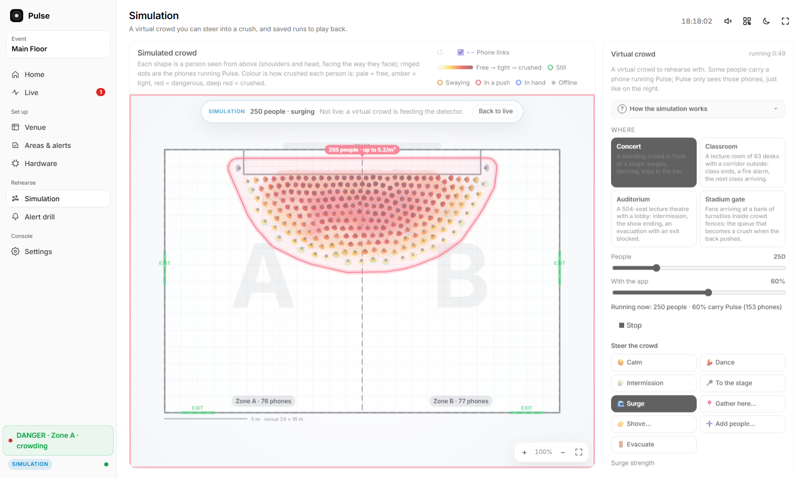

# Pulse

**Early warning for crowd crushes, using the phones already in the crowd.**

[](https://github.com/Drivera0/crowd-crush/actions/workflows/ci.yml)

Phones in a crowd stream their motion to one Go server. Each phone is a dot on the venue map. When neighbouring phones start swaying in a wave that travels from person to person, or people pack in past a safe density, the zone goes yellow, then red. Staff get a plain-language briefing, spoken aloud, a sign on the barrier flashes, and each phone in danger shows its owner which way to move.

Dancing and jumping (everyone moving *together*) don't set it off. A push travelling *through* the crowd does.



*A simulated surge at a stage front, running with no API keys. Each shape is a person, coloured by how crushed they are; ringed dots are the 60 % carrying a phone, which is all Pulse sees.*

Built solo at StormHacks 2026.

## Run it locally

No accounts, no API keys and no internet are needed. You need Go 1.25+ and Node 20+.

```sh
git clone https://github.com/Drivera0/crowd-crush.git
cd crowd-crush
make build        # npm install, build the two web apps, build the Go binaries
./bin/pulse       # dashboard: http://localhost:8080/dash/   phone page: http://localhost:8080/
```

Then, with no phones at all, either:

- open the dashboard's **Simulation** page and press **Start simulation**: 250 simulated people in a concert venue, steerable from the page (surge toward the stage, shove, open and close exits). Alerts, briefings and the ground truth appear next to the map; or
- run `make sim` in a second terminal: 24 scripted fake phones connect over the real WebSocket and a push wave builds until the zone goes red (about 30 s).

`make test` runs the Go tests (about a minute); `make check` adds the TypeScript type check.

### Optional services

Every external service fails soft. With a key missing or the network down, Pulse logs it and keeps detecting.

| Service | What it adds | Without it |
|---|---|---|
| Gemini (`GEMINI_API_KEY`) | writes the alert briefing, reads an uploaded floor plan, answers "ask about the last 10 minutes" | a template briefing built from the same numbers |
| ElevenLabs (`ELEVENLABS_API_KEY`, `ELEVENLABS_VOICE_ID`) | speaks the briefing | the browser's own speech synthesis |
| Tiger Data / TimescaleDB (`TIGER_DATABASE_URL`) | stores readings and alerts | JSONL files in `recordings/auto/` |
| Arduino sign and ESP32 zone lights (`SIGN_URL`) | flash at the barrier | no boards; the dashboard still shows every level |
| Cloudflare Tunnel (`PUBLIC_URL`) | HTTPS address for real phones | localhost and the simulators |

To use any of them, copy `.env.example` to `.env` and fill in what you have. [docs/SETUP.md](docs/SETUP.md) walks through each one.

### Real phones

Browsers only give a page motion-sensor access over HTTPS. `make tunnel` starts a Cloudflare quick tunnel and the dashboard's QR code picks up its address. On the phone: scan, tap **Join**, allow motion access, keep the page open. The phone can sit in a pocket or a hand, any way up.

## What it does

- **Travelling-wave detection.** Cross-correlates the motion of physically neighbouring phones. A push shows up as the same sideways movement arriving 120–1200 ms later at the next person, along a chain of at least three people. Movement with no lag is dancing; periodic movement is walking; vertical movement passed along is a stadium wave. None of those alert.
- **Density.** DBSCAN clusters, a local peak-density estimate corrected for how many people have the page open, and an early warning that projects the trend ("reaches 4 per m² in about 12 s").
- **Queue or crush.** A dense aisle that is flowing is a queue. The same density with nobody getting out is how a crush starts. Pulse tells them apart by whether anyone leaves the densest spot.
- **Guidance on the phone.** A phone in danger shows an arrow toward fewer people and the nearest open exit, sideways out of a push and never against it.
- **Position without tapping.** A per-phone Kalman filter fuses the entry point, GPS, step counting, compass heading, Bluetooth beacons and "these two phones are moving as one" links.
- **Phone-to-phone mesh.** Phones link over WebRTC data channels and relay for each other, so a phone that loses its connection still reports and is still warned.
- **Crowd simulator.** A Social Force Model crowd (Helbing 1995/2000) in a concert venue, classroom, auditorium or stadium gate, checked against published pedestrian-flow measurements. Simulated phones go through the same pipeline as real ones, and the simulator knows the true pressure and density, so every run reports whether Pulse warned before the crowd turned dangerous.
- **Operator console.** Venue map, staff-drawn watch areas with their own rules, incident cards with acknowledge / resolve / escalation, a "why did it fire?" view of the two traces and their correlation curve, alert drills, and replay of saved runs.
- **Hardware.** An Arduino Uno R4 WiFi sign and ESP32 zone lights, over Wi-Fi or USB serial, plus an Android shell app for the things a web page can't do.

Math detects; AI explains. Gemini never decides whether a zone is in danger.

## How it works

```
 phones (TS page)  ──ws /ws/phone──►  Go server  ──ws /ws/dash──►  dashboard (TS, SVG)
                                       │  ├─ clock sync per phone (NTP-style, best of 8 pings)
 simulators (Go)   ──same path──────►  │  ├─ 30 s ring buffer per phone
                                       │  ├─ detector step every 250 ms
                                       │  ├─ storage: TimescaleDB or JSONL
                                       │  ├─ briefing: Gemini or template
                                       │  ├─ voice: ElevenLabs or browser speech
                                       │  └─ sign and zone lights: HTTP or USB serial
                                       └─ one binary serves the pages, sockets and API
```

Each phone sends a 100 ms summary of its accelerometer and its gravity vector. The server puts every phone on one clock, levels each reading with gravity so the phone can be carried at any tilt, band-passes the horizontal motion to 0.15–1.5 Hz, and compares each phone with its nearest neighbours. Zone scores have hold times and hysteresis, so one shove can reach yellow but not red.

- [docs/HOW-IT-WORKS.md](docs/HOW-IT-WORKS.md): detection, zones, density, guidance, alerts, the HTTP API at a glance
- [docs/REFERENCE.md](docs/REFERENCE.md): the full wire protocol and every endpoint
- [docs/SIMULATOR.md](docs/SIMULATOR.md): the crowd model and its validation
- [docs/LOCATE.md](docs/LOCATE.md): the position estimator

## Measured

All of this is from simulators and synthetic phones, with thresholds tuned on the same simulators. It shows the method works, not that the thresholds are right for a real crowd.

| | Result | Source |
|---|---|---|
| False alarms | 0 red alerts in 600 look-alike runs (dancing, swaying, stadium waves, walking, bumping) | [docs/EVAL.md](docs/EVAL.md) |
| Misses | 22 of 160 real-push runs never went red, 19 of them a push through a jumping crowd | [docs/EVAL.md](docs/EVAL.md) |
| Phones at any tilt | push wave caught in 20 of 20 crowds with gravity levelling, 5 of 20 without | [docs/REFERENCE.md](docs/REFERENCE.md) |
| Rough GPS positions | surges caught in 58 of 60 runs with the position estimator, 0 of 60 without | [docs/LOCATE.md](docs/LOCATE.md) |
| Load | 1000 phones, 10,000 messages/s, none dropped, dashboard snapshots steady at 10 Hz | [docs/loadtest.md](docs/loadtest.md) |
| Detector cost | about 30 ms per step at 1000 phones | `go test ./server/internal/detect -bench Step` |

`make eval` and `make loadtest N=1000` regenerate the two reports.

## Built with

Go (one server binary; [coder/websocket](https://github.com/coder/websocket), [pgx](https://github.com/jackc/pgx)) · TypeScript and Vite with no UI framework, the map drawn in SVG · WebRTC data channels · TimescaleDB · Gemini and ElevenLabs over plain HTTP · Arduino C++ (Uno R4 WiFi, ESP32, Bluetooth LE) · Kotlin (Android WebView shell)

## Repository layout

```
server/cmd/pulse        the server: phone page, dashboard, WebSockets and API in one binary
server/cmd/sim          scripted fake phones over the real WebSocket (17 scenarios)
server/cmd/eval         every scenario × N random crowds → docs/EVAL.md
server/cmd/loadtest     N fake phones against a running server → docs/loadtest.md
server/cmd/boards       find, flash and check the boards on USB
server/cmd/dashtail     dashboard snapshots in a terminal
server/internal/
  detect/               levelling, filters, neighbour pairs, wave detection, zones
  crowd/                clusters, density, flow, early warning, guidance
  crowdsim/             Social Force Model crowd, venues, ground truth
  locate/               position estimator
  hub/ clocksync/       connections, mesh signalling and relay, clock sync
  app/                  pipelines (live, replay, sim), alerts, HTTP API
  brief/ voice/ sign/ store/   Gemini, ElevenLabs, boards, TimescaleDB / JSONL
  protocol/             wire format (source of truth; mirrored in web/shared)
web/phone               phone page          web/dashboard   operator console
web/shared              TypeScript mirror of the wire format
arduino/                sign (Uno R4 WiFi) and zone-light (ESP32) sketches
android/                Android shell app
recordings/             saved runs for tests and replay
scripts/                tunnel + server launcher, board flashing, key setup
docs/                   technical docs; docs/hackathon/ holds the pitch, demo run sheets and deck notes
```

Web development with hot reload: run `./bin/pulse`, then `cd web && npm run dev:dash` (or `dev:phone`). Vite proxies the API and sockets to :8080.

Every detector threshold lives in one struct: `./bin/pulse -dump-config > detect.json`, edit, `./bin/pulse -config detect.json`. `detect.example.json` holds the defaults.

## Privacy

A random session ID, a position in the venue and motion numbers. No names, contacts, location history, audio or photos. GPS is converted to venue-relative metres the moment it arrives; latitude and longitude are never stored, logged or sent to the dashboard.

## Honest limits

- A web page only streams while it is open. A real event would build this into its official app.
- Everything above was measured in simulation. A handful of testers proves the method, not the thresholds for 50,000 people.
- Locating phones in a real crowd is the hard part. Phone GPS is good to 5–25 m outdoors and worse indoors, far coarser than the 1.1 m neighbour radius.
- Density counts phones, so people per m² is only as good as the estimate of how many people have the page open.
- In the crowd simulator the travelling-wave detector almost never fires: stiff simulated bodies pass a push on faster than the detector's 120 ms floor. Recordings of real pushes would settle whether the model or the detector is wrong ([docs/SIMULATOR.md](docs/SIMULATOR.md)).
